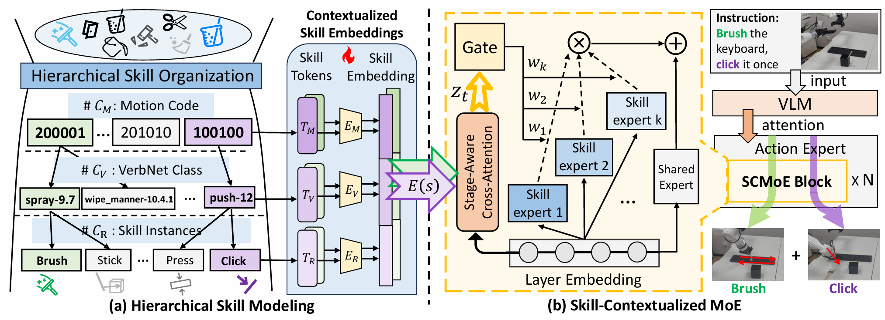

# SkillNet: Hierarchical Skill Modeling for Compositional Generalization in Vision-Language Action Models

[Paper (OpenReview)](https://openreview.net/forum?id=CPuJWWgka2) |
[Project Website](https://xsw1208.github.io/skillnet-website/) |
[Code](https://github.com/VIPL-VSU/SkillNet)

[](https://openreview.net/forum?id=CPuJWWgka2)
[](https://github.com/VIPL-VSU/SkillNet/actions/workflows/release-check.yml?query=branch%3Amain)

<p align="center">
  
</p>

This repository contains the open-source release for SkillNet. The release
focuses on the SkillNet code used for LIBERO in-domain training, LIBERO-Skill
compositional out-of-domain evaluation, and RoboTwin few-shot transfer.

## Release Contents

- `skill_moe/skillnet/`: SkillNet source tree for training and evaluation.
- `skill_moe/skillnet/examples/libero/`: LIBERO and LIBERO-Skill evaluation entrypoints.
- `skill_moe/skillnet/third_party/libero/libero/libero/bddl_files/libero_skill_obj/`: LIBERO-Skill task definitions.
- `skill_moe/skillnet/third_party/libero/libero/libero/bddl_files/libero_skill_obj/public_task_manifest.json`: public 9-task LIBERO-Skill manifest.
- `skill_moe/skillnet/third_party/libero/libero/libero/init_files/libero_skill_obj/`: LIBERO-Skill initial-state files.
- `data_process/skill_hierarchy/`: motion-code annotation, clustering, and tokenization utilities.
- `data_process/libero/`: LIBERO-40 and LIBERO-90 source-download and LeRobot conversion scripts.
- `data_process/robotwin/`: RoboTwin-2.0 few-shot task download, conversion, metadata, and collection helpers.
- `docs/quick_start.md`: installation, environment setup, checkpoint download, and smoke checks.
- `docs/release_status.md`: current release-readiness checklist and known external asset gates.
- `docs/skill_hierarchy.md`: SkillNet hierarchy construction and tokenization notes.
- `docs/libero_data_processing.md`: complete notes for reproducing the LIBERO LeRobot datasets used by the SkillNet training configs.
- `docs/training_and_evaluation.md`: public launch instructions for LIBERO-40/90 Skill-MoE training and LIBERO-Skill evaluation.
- `docs/robotwin_few_shot.md`: RoboTwin few-shot task lists, data setup, training, evaluation, and reported results.
- `CITATION.cff`: machine-readable citation metadata for the SkillNet paper and software release.
- `CONTRIBUTING.md`, `SUPPORT.md`, `SECURITY.md`: public contribution,
  support, and sensitive-information handling guidelines.
- `.github/ISSUE_TEMPLATE/` and `.github/pull_request_template.md`: public
  issue and pull-request templates for reproducible reports.

The RoboTwin few-shot release includes paper-aligned task plans, public data
helpers, LeRobot conversion, skill metadata, training configs, training
launchers, and a simulator-side evaluation adapter for a local RoboTwin-2.0
checkout.

## Experiments Covered

- LIBERO-40 in-domain Skill-MoE training and evaluation.
- LIBERO-90 Skill-MoE training and LIBERO-Skill zero-shot evaluation.
- RoboTwin-2.0 few-shot transfer protocol, data preparation, training launchers, and simulator-side evaluation adapter.

| Track | Config | Data processing and annotations | Training and evaluation notes |
| --- | --- | --- | --- |
| LIBERO-40 | `pi05_libero_moe_skill_4_40` | `data_process/libero/convert_libero_40_to_lerobot.py`, `data_process/libero/instruct2plan_40.json`, and `docs/libero_data_processing.md` | `docs/training_and_evaluation.md` |
| LIBERO-90 to LIBERO-Skill | `pi05_libero_moe_skill_4_90` | `data_process/libero/convert_libero_90_to_lerobot.py`, `data_process/libero/instruct2plan_90.json`, `data_process/libero/export_libero_skill_slices.py`, and the LIBERO-Skill manifest under `skill_moe/skillnet/third_party/libero/` | `docs/training_and_evaluation.md` |
| RoboTwin pretraining | `pi05_robotwin_moe_skill_pretrain` | `data_process/robotwin/download_robotwin_sources.py`, `data_process/robotwin/convert_robotwin_to_lerobot.py`, `data_process/robotwin/build_robotwin_skill_metadata.py`, and `data_process/robotwin/robotwin_plan.json` | `docs/robotwin_few_shot.md` |
| RoboTwin per-task few-shot transfer | `pi05_robotwin_moe_skill_transfer` | `data_process/robotwin/collect_train_data.sh`, `data_process/robotwin/convert_robotwin_to_lerobot.py`, `data_process/robotwin/build_robotwin_skill_metadata.py`, and `data_process/robotwin/skill_anno_robotwin.json` | `docs/robotwin_few_shot.md` |

Checkpoint download commands, exact Hub identifiers, global batch sizes,
training steps, Skill-MoE expert/router settings, normalization-stat paths,
checkpoint directory conventions, LIBERO-Skill task order, and zero-shot
rollout budgets are specified in `docs/training_and_evaluation.md`. RoboTwin
checkpoints are trained locally from the included configs and are not shipped as
prebuilt weights in this release.

## 1. Quick Start

Clone SkillNet and keep the repository root as your documentation and data
processing root:

```bash
# On Windows, clone under a short, non-user-specific directory because
# LIBERO-Skill task filenames are long. The -c flag handles checkout; the
# local config keeps later git status/diff commands from hitting path limits.
git -c core.longpaths=true clone --branch skillnet-public-release --depth 1 https://github.com/VIPL-VSU/SkillNet.git SkillNet
cd SkillNet
git config core.longpaths true
```

If HTTPS cloning is blocked by your network, use the same branch over SSH:

```bash
git -c core.longpaths=true clone --branch skillnet-public-release --depth 1 git@github.com:VIPL-VSU/SkillNet.git SkillNet
```

Follow `docs/quick_start.md` for installation, smoke checks, checkpoint
download, normalization-stat computation, training launchers, and evaluation
commands. The runnable SkillNet source root used by training commands is
`skill_moe/skillnet`.

Before installing simulator stacks, you can run:

```bash
python scripts/check_public_release.py
```

To also verify the editable package metadata in a temporary Python 3.10
environment without downloading heavyweight runtime dependencies, run:

```bash
python scripts/check_public_release.py --install-smoke
```

If Python 3.10 is not discoverable as `3.10` on your machine, pass an explicit
interpreter:

```bash
python scripts/check_public_release.py --install-smoke --install-python /path/to/python3.10
```

To verify the public Hugging Face checkpoint and source-dataset links, run:

```bash
python scripts/check_public_release.py --hub-smoke
```

`--hub-smoke` checks public Hub visibility without using local Hub tokens.
Before announcing direct LIBERO training from Hub datasets, also run the
dataset-visibility check documented in `docs/release_status.md`.

## 2. Skill Hierarchy

SkillNet builds reusable skill tokens from short manipulation subtasks. The
public hierarchy tools cover released-tokenizer usage, optional motion-code
annotation, fixed-center weighted motion-code assignment, and final
tokenization into:

```text
[motion_cluster_id, verbnet_class_id, verb_id]
```

See `docs/skill_hierarchy.md` and `data_process/skill_hierarchy/`.

## 3. In-Domain Training and Evaluation

LIBERO data processing is documented in `docs/libero_data_processing.md`. The
released converters build the LIBERO-40 and LIBERO-90 LeRobot-format training
data from the public RLDS sources plus the included compact slice-index
metadata.

LIBERO-40 in-domain training and evaluation launch commands are documented in
`docs/training_and_evaluation.md`.

## 4. LIBERO-90 Training for LIBERO-Skill Zero-Shot Evaluation

LIBERO-90 training and LIBERO-Skill zero-shot evaluation are documented in
`docs/training_and_evaluation.md`. The zero-shot benchmark does not use
LIBERO-Skill task trajectories for training. The released LIBERO-Skill
benchmark files are included under the `bddl_files/libero_skill_obj` and
`init_files/libero_skill_obj` directories inside
`skill_moe/skillnet/third_party/libero/libero/libero/`. The reported public
benchmark task order is recorded in
`bddl_files/libero_skill_obj/public_task_manifest.json`. The runtime task ids
use compact `skill_obj_XX` aliases for portable checkout paths; the manifest
and bddl `:language` fields preserve the original natural-language tasks.

## 5. RoboTwin Few-Shot Transfer

RoboTwin-2.0 few-shot data download, LeRobot conversion, task lists, training
commands, evaluation adapter, and reported SkillNet results are documented in
`docs/robotwin_few_shot.md`.

## Citation

If you use SkillNet, please cite:

```bibtex
@inproceedings{xie2026skillnet,
  title={SkillNet: Hierarchical Skill Modeling for Compositional Generalization in Vision-Language Action Models},
  author={Xie, Senwei and Zhang, Yuntian and Tan, Zhenzhou and Wang, Ruiping and Wang, Pengwei and Zhang, Shanghang and Chen, Xilin},
  booktitle={Proceedings of the 43rd International Conference on Machine Learning},
  year={2026}
}
```

Machine-readable citation metadata is provided in `CITATION.cff`.

## License

Unless otherwise noted, this repository is released under Apache-2.0. Third-party components retain their original licenses; see `NOTICE.md` and any license files under `skill_moe/skillnet/third_party/`.
